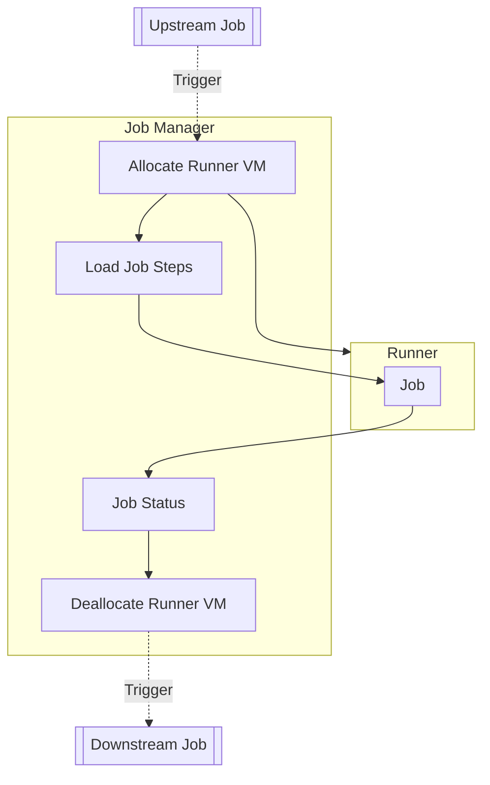

# Github Actions Job Manager

```mermaid
flowchart 

subgraph runner1 [Runner]
subgraph job1 [Job]
end
end

subgraph job_man1 [Job Manager]
alloc1[Allocate Runner VM]
loads1[Load Job Steps]
stat1[Job Status]
dealloc1[Deallocate Runner VM]
alloc1-->loads1
end

job1@{view: collapsed}

job1-->stat1-->dealloc1

alloc1-->runner1
loads1-->job1

upstream_job@{shape: subproc, label: Upstream Job}-.->|Trigger|alloc1
dealloc1-.->|Trigger|downstream_job@{shape: subproc, label: Downstream Job}
```
