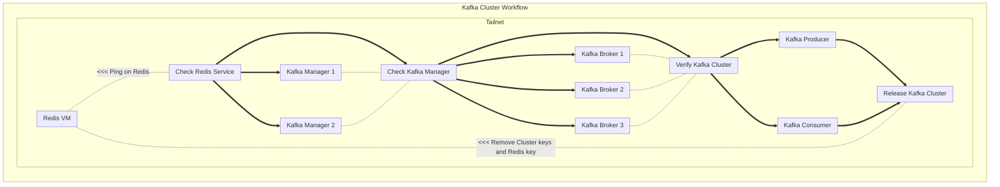

# Kafka cluster

```mermaid
flowchart LR

subgraph workflow [Kafka Cluster Workflow]
subgraph ts_net [Tailnet]
subgraph redis [Redis VM]
end
subgraph check_redis [Check Redis Service]
end
subgraph kafka_manager_1 [Kafka Manager 1]
end
subgraph kafka_manager_2 [Kafka Manager 2]
end
subgraph check_kafka_manager [Check Kafka Manager]
end
subgraph kafka_broker_1 [Kafka Broker 1]
end
subgraph kafka_broker_2 [Kafka Broker 2]
end
subgraph kafka_broker_3 [Kafka Broker 3]
end
subgraph verify_cluster [Verify Kafka Cluster]
end
subgraph consumer [Kafka Consumer]
end
subgraph producer [Kafka Producer]
end
subgraph release [Release Kafka Cluster]
end
end
end

redis@{view: collapsed}
check_redis@{view: collapsed}
check_kafka_manager@{view: collapsed}
kafka_broker_1@{view: collapsed}
kafka_broker_2@{view: collapsed}
kafka_broker_3@{view: collapsed}
producer@{view: collapsed}
consumer@{view: collapsed}
release@{view: collapsed}
kafka_manager_1@{view: collapsed}
kafka_manager_2@{view: collapsed}
check_kafka_manager@{view: collapsed}
verify_cluster@{view: collapsed}

redis-.-|<<< Ping on Redis|check_redis
check_redis==>kafka_manager_1
check_redis==>kafka_manager_2
check_redis==>check_kafka_manager
kafka_manager_1-.-check_kafka_manager
kafka_manager_2-.-check_kafka_manager
check_kafka_manager==>kafka_broker_1
check_kafka_manager==>kafka_broker_2
check_kafka_manager==>kafka_broker_3
check_kafka_manager==>verify_cluster

kafka_broker_1-.-verify_cluster
kafka_broker_2-.-verify_cluster
kafka_broker_3-.-verify_cluster

verify_cluster==>consumer
verify_cluster==>producer
producer==>release
consumer==>release
redis-.-|<<< Remove Cluster keys and Redis key|release
```
