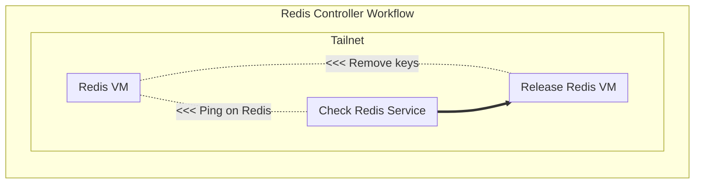

# Managing VMs with Redis

```mermaid
flowchart LR

subgraph workflow [Redis Controller Workflow]
subgraph ts_net [Tailnet]
subgraph redis [Redis VM]
end
subgraph check_redis [Check Redis Service]
end
subgraph release [Release Redis VM]
end
end
end

redis@{view: collapsed}
check_redis@{view: collapsed}
release@{view: collapsed}


redis-.-|<<< Ping on Redis|check_redis
redis-.-|<<< Remove keys|release
check_redis==>release
```
