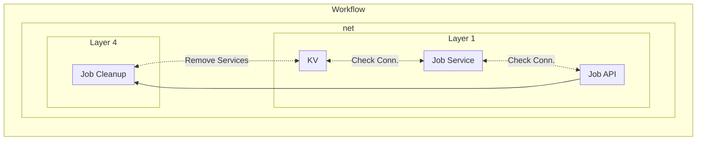

# Sample workflow with custom controller

```mermaid
flowchart LR

subgraph wf [Workflow]
subgraph net
subgraph layer1 [Layer 1]
subgraph job_kv [KV]
end
subgraph job_service [Job Service]
end
subgraph job [Job API]
end
end
subgraph layer4 [Layer 4]
subgraph job_cleanup [Job Cleanup]
end
end
end
end

job_kv@{view: collapsed}
job_service@{view: collapsed}
job@{view: collapsed}
job_cleanup@{view: collapsed}

job_kv <-.-> |Check Conn.| job_service <-.-> |Check Conn.| job --> job_cleanup
job_cleanup <-.-> |Remove Services| job_kv
```
