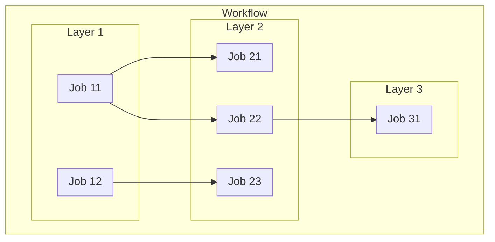

# Sample standard GH Actions workflow

```mermaid
flowchart 
subgraph wf [Workflow]
subgraph layer1 [Layer 1]
subgraph job1 [Job 11]
end
subgraph job2 [Job 12]
end
end
subgraph layer2 [Layer 2]
subgraph job3 [Job 21]
end
subgraph job4 [Job 22]
end
subgraph job6 [Job 23]
end
end
subgraph layer3 [Layer 3]
subgraph job5 [Job 31]
end
end
end

job1-->job3
job1-->job4-->job5
job2-->job6

job1@{view: collapsed}
job2@{view: collapsed}
job3@{view: collapsed}
job4@{view: collapsed}
job5@{view: collapsed}
job6@{view: collapsed}
```
